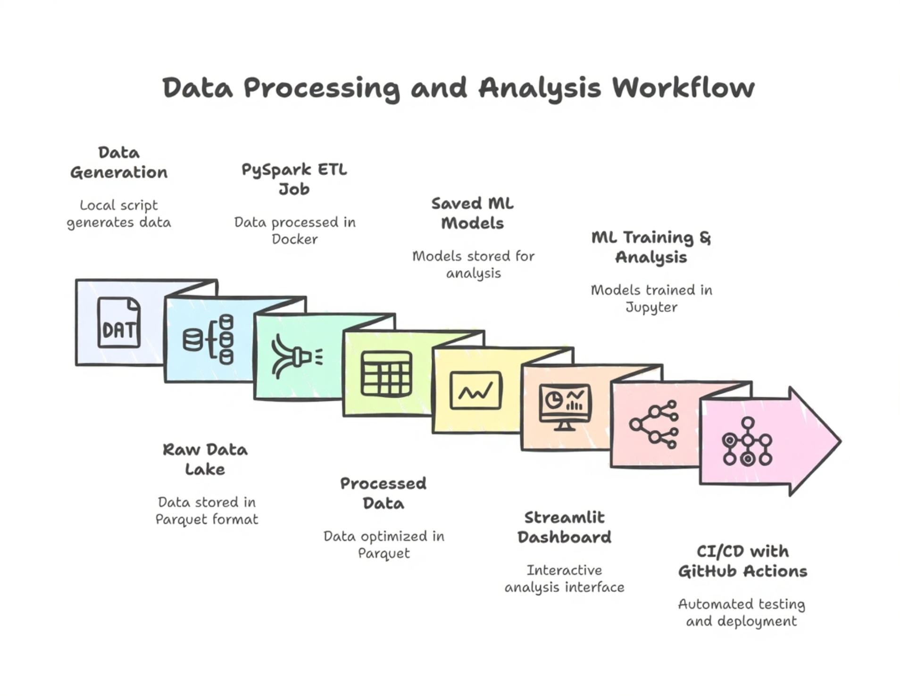

# Fitness Analytics with PySpark

# 1. Project Vision
This repository demonstrates a production grade, end-to-end data science project. The core philosophy is to build a scalable, reliable, and automated system for analyzing fitness tracker data using a modern data engineering and MLOps stack.

The project ingests and processes a substantial dataset of **358, 497 records from 1,959 users** and showcase a full project lifecycle: from foundational ETL and advanced ML modeling with **PySpark** to robust MLOps workflow using Docker for reproducibility and **GitHub Actions** for continuous integration and testing.

# 2. Technical Architecture
The system is designed as a modular pipeline, ensuring scalability and maintainability.

# 3. Phase I: The Data Foundation - ETL with PySpark

The realibility of the entire system depends on a robust data foundation. We choose **Apache Spark (PySpark)** as our processing engine for its ability to handle large datasets in a distributed manner and its unified API for data processing and machine learning.

**The ETL Pipeline** (`src/etl_pipeline.py`)
* **Extraction:** The pipeline reads over 180 daily-partitioned Parquet files. We chose Parquet for its columnar storage format, which provides significant performance gains and storage efficiency.

* **Transformation:** The core logic is encapsulated in a testable transform_data function. Key transformations include:
    * **Schema Enforcement:** Casting string dates to DateType for proper time-series operations.

    * **Feature Engineering:** Creating high-value features like `calories_to_steps_ratio`, which proved critical for distinguishing between low-step, high-intensity activities (e.g., swimming) and high-step, low-intensity ones (e.g., walking).

* Loading: The transformed data is written to `data_lake/processed/`, partitioned by `year` and `month`. This partitioning scheme is a critical optimization, allowing Spark to perform partition pruning and drastically speed up queries that filter on specific time ranges.

# 4. Phase II: Advanced Analytics & Machine Learning
With a clean dataset, we used PySpark MLlib and Spark SQL to build predictive models and derive insights.

## Machine Learning Models

1. **User Segmentation (K-Means Clustering):** An unsupervised model identified three statistically distinct user personas, enabling targeted analysis and engagement strategies.

2. **Activity Prediction (Logistic Regression):** A multi-class classification pipeline was trained to predict activity_type. The model achieved a strong **84% accuracy** on the test set.

3. **Calorie Prediction (Linear Regression):** A regression pipeline, featuring a `OneHotEncoder` to handle categorical features, was built to predict `calories_burned`. The model was highly successful, achieving an **R² of 0.91**, indicating that our features explain 91% of the variance in calorie expenditure.

4. **Activity Recommendation (ALS):** A collaborative filtering model was trained to provide personalized activity recommendations, using the frequency of activities as an implicit user rating.

# 5. Phase III: Real-Time Processing with Spark Structured Streaming

To demonstrate a more advanced, production-ready capability, we implemented a real-time analytics pipeline.

* **Architecture:** A data generator script simulates a live stream of user activity.

* **Stateful Aggregation:** We used Spark Structured Streaming to consume this data, treating the stream as an unbounded table. The core of the analysis is a stateful aggregation using **30-second tumbling windows**.

* **Watermarking:** To ensure the long-running stream is resilient and does not run out of memory, a **1-minute watermark** is applied. This allows Spark to correctly handle late-arriving data and discard old state that is no longer needed. This is a critical feature for production streaming jobs.

# 6. Phase IV: MLOps - Building a Resilient, Automated System

This project's core strength is its robust MLOps foundation, which ensures consistency, reliability, and automation.

**Containerization with Docker**
The entire environment is defined in the `Dockerfile`.

* **Reproducibility:** It starts from an `openjdk:11-jre-slim` base image to provide the necessary Java runtime for Spark. It then installs specific versions of Python, Spark, and all required Python libraries. This creates a self-contained, portable environment, eliminating the "it works on my machine" problem.

* Development Workflow: The container is designed for both interactive development (via Jupyter) and automated execution (via `spark-submit`). Volume mounting is used to sync local code and data with the container, allowing for a seamless development loop.

## CI/CD with GitHub Actions

The workflow in `.github/workflows/ci.yml` automates our testing and integration process. On every `push` to `main`, it executes the following on a clean GitHub-hosted runner:

1. **Build Docker Image**: Validates that the application and its dependencies can be successfully built.

2. **Run Unit Tests (The Quality Gate)**: This crucial step executes our `pytest` suite. It runs fast, isolated tests on our core ETL logic, including checking for edge cases like division-by-zero. **If any unit test fails, the entire workflow fails**, preventing buggy code from proceeding.

3. **Run Integration Test (End-to-End Validation):** After unit tests pass, the full `src/etl_pipeline.py` is executed using `spark-submit`. This tests the entire pipeline, from data reading to writing the final output, ensuring all components work together correctly inside the container.

# 7. Dashboard
The final result is a multi-page Streamlit dashboard that serves as an interactive front-end for the entire project.

* **Home Page**: Introduces the project and its architecture.

* **Data Overview**: Provides a browsable view of the processed data and its schema.

* **EDA & Clustering**: Showcases key visualizations and the results of our user segmentation model.

* **Live Predictions**: Allows users to interact directly with our saved classification and regression models, input custom values, and receive real-time predictions.

# 8. Local Setup and Execution
**Prerequisites**: Docker Desktop must be installed and running.

**Step 1: Build the Docker Image**
Clone this repository and run the following command from the project root:

`docker build -t fitness-tracker-app .`

**Step 2: Data Prep & Model Training (One-Time Setup)**

You must first run the main Jupyter Notebook to generate the dataset and train the ML models.

1. Start an interactive container:

    `docker run -it --rm -p 8888:8888 --name fitness-dev --mount type=bind,source="$(pwd)",target=/app fitness-tracker-app bash`

2. Inside the container's shell, start the Jupyter server:

This command is run INSIDE the container's shell

`python3 -m notebook --ip=0.0.0.0 --no-browser --allow-root --NotebookApp.token='' --NotebookApp.password=''`

Access the server at `http://localhost:8888` and run **all cells in notebooks/1_ETL_and_EDA.ipynb**. This will generate the necessary processed data and save the trained models to the `models/` directory.

**Step 3: Launch the Streamlit Dashboard:**

Once the data and models are in place, stop the previous container and launch the dashboard:

`docker run --rm -p 8501:8501 --name fitness-dashboard --mount type=bind,source="$(pwd)",target=/app fitness-tracker-app streamlit run /app/dashboard/1_Home.py`

Access the multi-page dashboard in your browser at: `http://localhost:8501`

