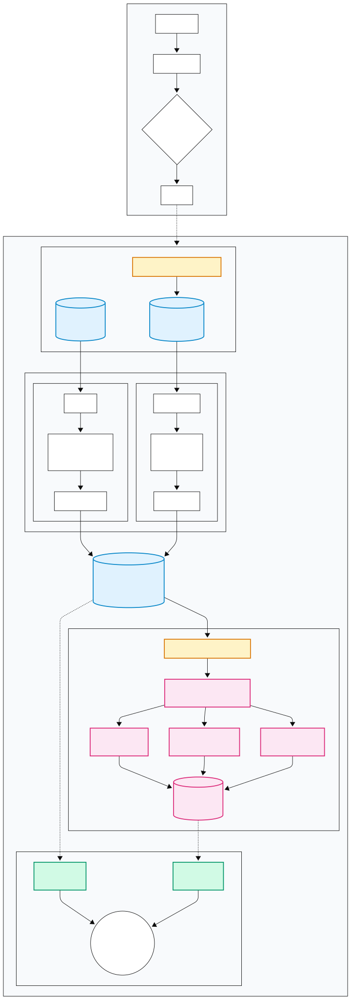

# Fitness Analytics with PySpark


# 1. Project Vision
This repository houses a production-grade data intelligence platform designed to ingest, process, and analyze high-volume fitness tracker data. The system implements a **Lambda Architecture** pattern, utilizing **Apache Spark** for both batch historical processing and real-time streaming analytics.

The platform serves as a reference implementation for a modern Data Science lufecycle, demonstrating:
- **Scalable ETL:** Distribued data processing with PySpark on partitioned Parquet data lakes.
- **Robust MLOps:** Containerized environments (Docker), automated testing gates (pytest), and CI/CD pipelines (GitHub Actions).
- **Advanced Analytics:** Integrated Scikit-Learn pipelines for user segmentation, activity classification, and caloric forecasting.
- **Interactive Serving:** A Streamlit based frontend for real data model inference and data exploration.

<br>

# [Live Demo](https://fitness-tracker-analysis.streamlit.app/)

<br> 

# 2. System Architecture
The system is architectured as a modular, containerized ecosystem. It decouples data, generation, processing, and serving layers to ensure scalability and maintainability.



<br>

# 3. Data Engineering Foundation (ETL)
The reliability of the system relies on a unified Spark ETL pipeline defined in `src/etl_pipeline.py`

## 3.1 Batch Processing Layer
- **Ingestion:** Reads over 180 daily-partioned Parquet files. Parquet was selected for its columnar storage efficiency and predicate pushdown capabilities.
- **Transformation Logic:**
    - **Schema Enforcement:** Strict casting of string datetimes to `DataType` ensures temporal consistency.
    - **Feature Engineering:** Calculating of derived metrics such as `calories_to_steps_ratio`, a high variance feature critical for distinguishing activity intensity (e.g. Swimming vs. Walking) 
- **Optimised Loading:** Data is written to the Processed Data Lake partitioned by `year` and `month`. This layout enables Partition Pruning in downstream queries drastically reducing I/O overhead.

<br>

## 3.2 Real-Time Streaming Layer
To handle live data ingestion, we utilise Spark Structured Streaming:
- **Micro-batch Processing:** Consumes data from the streaming buffer (`/streaming_input`) treating the stream as an unbounded table.
- **Stateful Aggregation:** Computes metrics over a **30-second tumbling window**.
- **Watermarking:** A **1-minute watermark** mechanism handles late-arriving data, allowing the engine to drop old state and manage usage efficiently in long-running production jobs.

# 4. Machine Learning & Advanced Analytics
We employ `scikit-learn` pipelines to build modular, reproducible machine learning workflows. The training process (`src/train_dashboard_models.py`) persists serialised models to a registry for inference.

| Model Type | Algorithm | Use Case | Performance Metric |
| :--- | :--- | :--- | :--- |
| **Unsupervised** | K-Means Clustering | User Segmentation and Persona Identification | Silhouette Score |
| **Classification** | Random Forest Classifier | Activity Type Prediction (Multi-class) | $84\%$ Accuracy |
| **Regression** | Random Forest Regressor | Calorie Burn Prediction | $R^2$ = 0.91 |
| **Recommendation** | ALS Collaborative Filtering | Personalized Activity Suggestions | RMSE |


### Pipeline Architecture
Each model is wrapped in a generic Pipeline that includes:
1. `SimpleImputer`: Handles missing data (median strategy)
2. `StandardScaler/OneHotEncoder`: Normalises numerical features and encodes categorical variables.
3. `Estimator`: The core learning algorithm

This encapsulation ensures that raw input at inference time undergoes the exact same transformations as the training data, preventing training-serving skew.

# 5. MLOps: Reproducibility & Quality Assurance
The project enforces software engineering best practices through containerization and automation.

### Docker Containerization
The `Dockerfile` defines an executation an immutable execution environment based on `openjdk:11-jre-slim`.

### CI/CD with GitHub Actions
Every commit triggers the workflow defined in `.github/workflows/ci.yml`
1. Build Verification: Ensures the Docker image constructs successfully.
2. Unit Testing (`pytest`): Validates atomic transformation functions (e.g., verifying `calories_to_steps_ratio` handles division-by-zero).
3. Integration Testing: Submits a `spark-submit` job to container to verify the end-to-end execution of the ETL pipeline against a sample dataset.

<br>

# 6. Dashboard & Serving
The frontend is a multi-page Streamlit application (`dashboard/1_Overview.py`) that acts as the consumption layer:
- **Data Overview:** Browsable interface for the processed data lake.
- **Live Inference:** Interactive widgets allow stakeholders to input custom parameters (steps, heart rate) and receive real-time predictions from the loaded models.
- **Business Intelligence:** Visualises distinct user clusters and performance metrics.

<br>

# 7. Local Setup & Usage
**Prerequisites:** Docker Desktop installed.

### Step 1: Build the Environment

```bash
docker build -t fitness-tracker-app .
```

### Step 2: Pipeline Execution (ETL & Training)
Run the pipeline interactively to generate data and train models.

```bash
# Start the container
docker run -it --rm -p 8888:8888 --name fitness-dev \
    --mount type=bind,source="$(pwd)",target=/app \
    fitness-tracker-app bash

# Inside the container, run the ETL and Training scripts
python src/etl_pipeline.py
python src/train_dashboard_models.py
```

### Step 3: Launch Dashboard
```bash
docker run --rm -p 8501:8501 --name fitness-dashboard \
    --mount type=bind,source="$(pwd)",target=/app \
    fitness-tracker-app streamlit run /app/dashboard/1_Overview.py
```

Access the application at `http://localhost:8501`


